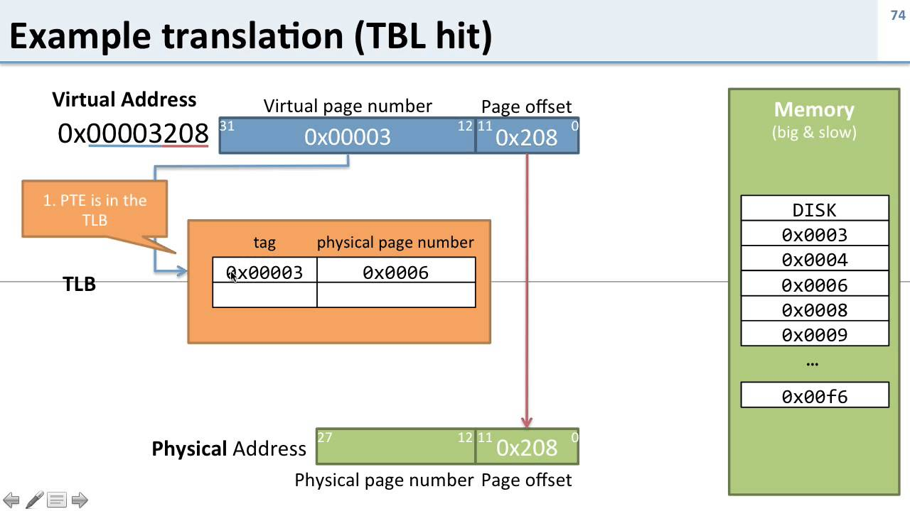

# Виртуальная память: определение и возможности



## Определение
**Виртуальная память (Virtual Memory)** — это механизм управления памятью в операционных системах, при котором каждому процессу предоставляется собственное непрерывное и изолированное адресное пространство (виртуальное адресное пространство), отображаемое (mapped) на физическую память и/или внешнее хранилище (обычно диск, через swap).

Это достигается с помощью аппаратной поддержки (**MMU — Memory Management Unit**) и **таблиц страниц (page tables)**, которые преобразуют виртуальные адреса, используемые процессами, в физические адреса в оперативной памяти.

---

## Что даёт виртуальная память

### 1. Изоляция процессов
Каждый процесс "видит" только своё адресное пространство.  
Один процесс не может напрямую обратиться к памяти другого — это повышает **безопасность** и **стабильность** системы.

### 2. Упрощение программирования
Программист оперирует единым непрерывным адресным пространством,  
не думая о фрагментации или реальном размере физической памяти.  
ОС сама распределяет физические страницы.

### 3. Возможность работы с памятью, превышающей размер ОЗУ
Если физической памяти не хватает, неиспользуемые страницы выгружаются на диск (**swap/pagefile**).  
Это позволяет запускать программы, которым нужно больше памяти, чем реально доступно в RAM.

### 4. Защита памяти
Таблицы страниц содержат **флаги доступа** (read/write/execute, user/kernel),  
предотвращая выполнение или запись туда, где это запрещено.  
Это механизм против **сбоев** и **эксплойтов**.

### 5. Эффективное использование памяти
- **Общие страницы** — код библиотек может быть разделён между процессами (read-only).
- **Ленивая загрузка (demand paging)** — страница выделяется только при обращении.
- **Copy-on-write** — при `fork` память не копируется целиком, а лишь помечается до первой модификации.

---

## Swap и виртуальная память

```bash
# Схема: виртуальное адресное пространство, RAM и Swap

Виртуальное адресное пространство (например, 48-битное у x86-64 → до 256 ТБ):

+---------------------------------------------------------------+
|                                                               |
|                        Виртуальные адреса                     |
|                                                               |
+---------------------------------------------------------------+
              |                         |
              |                         |
              v                         v
     +-------------------+       +-------------------+
     |      RAM          |       |       SWAP        |
     | (физическая память)|       | (диск/SSD/HDD)    |
     +-------------------+       +-------------------+
              |                         |
              +-----------+-------------+
                          |
                          v
                 Физические страницы
              (часть в RAM, часть в SWAP)


```

### Что такое swap
**Swap** — это область на диске, используемая ОС как расширение физической памяти (RAM).  
Когда ОЗУ заполнено, редко используемые страницы выгружаются во **внешнее хранилище**.

### Как swap влияет на виртуальную память
- Архитектурно **виртуальное адресное пространство фиксировано** (например, 48-бит у x86-64 → до 256 ТБ).
- Swap **не увеличивает этот теоретический максимум**.
- Но swap увеличивает **эффективный объём виртуальной памяти**, который можно реально использовать:
    - часть страниц хранится в RAM;
    - часть во swap.

### Итог
Swap позволяет:
- запускать программы, требующие больше памяти, чем доступно в RAM;
- избежать ошибок **Out Of Memory (OOM)** в ряде случаев;
- но при этом сильно снижает производительность, так как диск на порядки медленнее ОЗУ.

---

## Итоговое определение
Виртуальная память — это **абстракция**, скрывающая реальные ограничения физической памяти,  
обеспечивающая изоляцию и защиту, а также эффективное использование ресурсов.  
**Swap** является её расширением на диск, увеличивая эффективный объём, но не архитектурный предел.